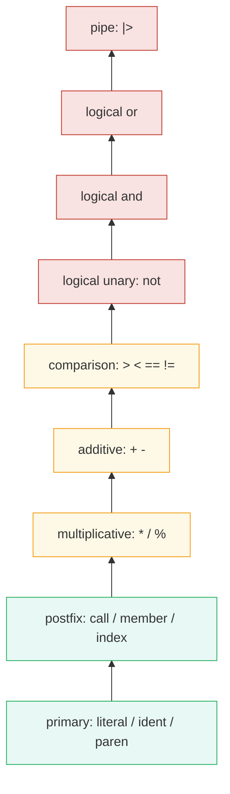

语言实现的第一层是把源码变成结构化数据。对 `cpp/pl/flux` 来说，这一层由 `syntax/scanner.rl`、生成的 scanner、`syntax/parser.cpp` 和 `syntax/ast.h` 组成。它的目标不是只让正确程序通过，而是尽量为后面的 runtime、CLI、LSP 和测试提供稳定、可定位的 AST。

## Scanner：把字符流切成 token

Flux 的词法并不只是普通标识符和数字。当前 scanner 覆盖了关键字、字符串、字符串插值、duration、RFC3339 风格 datetime、正则字面量、注释、pipe-forward、比较运算符、属性注解和类型语法相关 token。

正则字面量是一个典型细节。`/cpu.*/` 和除法操作符都以 `/` 开头，scanner 不能只靠单个字符判断。当前实现区分表达式上下文，在可能期待表达式的位置接受 regex literal，在普通二元运算位置按除法处理。这类细节决定了 parser 后面看到的 token 是否有语义。

scanner 还维护 line/column 信息。这个成本看起来不大，但收益很高：parser error、AST dump、LSP diagnostics、goto definition、semantic tokens 都需要准确的 source location。

## Token 设计里几个容易低估的点

第一个点是 `import`、`option`、`builtin`、`testcase` 这些关键字不是普通标识符。它们在文件级语法和语句级语法里有特殊入口，如果 scanner 不提前分类，parser 就必须在更多地方做字符串判断。

第二个点是 duration 和 unsigned integer。`1h`、`5m`、`42u` 看起来像数字加后缀，但语义完全不同。duration 后续要参与 time range/window 计算；unsigned integer 则进入普通 numeric value。scanner 和 parser 必须在 AST 层把它们分开。

第三个点是字符串插值。`"host ${user}"` 不是普通字符串拼接，parser 需要保留插值表达式，这样 runtime 才能在当前 environment 下求值。

第四个点是 regex。`=~ /cpu.*/` 和 `a / b` 的 `/` 不能用同一种扫描规则处理。当前 scanner 维护“是否处在可接受 regex literal 的表达式上下文”这个状态，避免把除法误扫成正则，或者把正则误扫成除法。

这些细节决定了 AST 是否干净。一个语言实现越往后走，越会发现前端 token 粗糙会让 runtime、formatter 和 LSP 都付出额外代价。

## Parser：递归下降与优先级分层

项目使用手写 parser。手写的好处是便于做错误恢复、调试 AST 输出，也方便贴合 Flux 中 pipe、call、member、index 这些高频语法。

表达式解析按优先级分层。大致关系可以理解为：



这保证了下面的表达式按预期组合：

```flux
data
    |> filter(fn: (r) => r.usage > 80 and r.host =~ /edge.*/)
    |> keep(columns: ["host", "usage"])
```

其中 `r.usage > 80 and r.host =~ /edge.*/` 会被解析为 logical expression，左右两边是 comparison expression；整个 `filter(...)` 又作为 pipe 右侧调用被挂接到左侧表流上。

## Pipe 表达式不是普通函数调用语法糖

`a |> f(x: 1)` 表面上可以理解为 `f(tables: a, x: 1)`，但 parser 不应该直接把它改写成普通 call。更稳的做法是保留 pipe expression 的 AST 形态，让 runtime 或后续 analyzer 明确决定左侧值如何注入右侧调用。

原因有两个。

第一，Flux 同时有 builtin 和用户函数。builtin 可能约定 pipe 参数名为 `tables`，用户函数则可能显式声明 `<-tables`。注入规则依赖 callee 的参数模型，parser 阶段并不知道完整语义。

第二，LSP 和 formatter 需要保留用户写法。AST 如果过早脱糖，formatter 就很难重建原始 pipe 链，goto definition 和 semantic tokens 也会失去一些语法上下文。

因此 parser 的职责是忠实表达语法结构，而不是急着优化或重写。

## AST 不是语法糖字符串

AST 的价值是让后续模块不再处理源码文本。比如：

- `ImportDeclaration` 保存 import path 和 alias。
- `FunctionExpr` 保存参数列表、默认值、pipe 参数和函数体。
- `CallExpr` 保存 callee 和 argument list。
- `MemberExpr` 和 `IndexExpr` 区分成员访问和索引访问。
- `LogicalExpr` 与 `BinaryExpr` 分开表达 `and/or` 和普通二元运算。
- `ObjectExpr` 支持普通 record，也支持 `{base with x: 1}` 这种 record update。

这种结构化表达使 runtime 可以做直接求值，LSP 可以做符号收集，formatter 可以重建布局，测试可以对 AST dump 做快照。

## AST 节点的所有权模型

当前 AST 主要使用 `std::unique_ptr` 表达树形所有权，用 `std::shared_ptr` 承载某些列表元素或跨结构引用。这个选择偏 C++ 工程实用主义：AST 生命周期由 `File` 根节点持有，解析完成后整体交给 runtime、dump、LSP 等消费者。

这种模型的优点是简单，不需要复杂 arena 就能保证节点释放。缺点是节点分配较多，parser 频繁运行时会有一定开销。对于 CLI 执行单个文件，这不是大问题；对于 LSP 高频 parse，则需要 AST 缓存来抵消成本。后续如果引入 incremental parser 或 arena allocator，可以优先在 LSP 热路径评估，而不是过早重写整个 AST 存储。

AST 还有一个重要原则：不要让 debug string 成为语义来源。`dump_ast` 是观察工具，runtime 和 LSP 应该消费结构化字段，而不是反解析 dump 文本。

## 文件级语法

当前 parser 支持常见 Flux 文件结构：

```flux
package demo

import "array"
import regexp "regexp"

option task = {name: "rollup", every: 1m}

normalize = (r) => ({r with host: regexp.findString(r: /edge-[0-9]+/, v: r.host)})

array.from(rows: [{host: "edge-1", value: 10}])
    |> map(fn: normalize)
```

文件体可以混合 package、import、option、变量赋值、表达式语句、builtin 声明和 testcase。`return` 主要用于 block-bodied function 或 testcase block。

## 错误恢复的现实边界

parser 已经有 `BadStmt`、`BadExpr` 这类节点，也在条件表达式、调用参数、数组、字典、对象属性和部分类型语法上做了恢复。但这还不是完整的容错 parser。对于语言服务器来说，坏程序仍然应该尽量产出可用 AST；对于 CLI 来说，错误信息应该尽量指向局部上下文。

这也是后续值得继续打磨的方向：错误恢复要服务于编辑器实时输入，而不是只服务于 batch parsing。

## AST location 为什么重要

前期实现语言时，容易把 source location 当成“调试附属品”。实际开发到 LSP 阶段后会发现，它是基础设施。

例如 lambda 参数：

```flux
filter(fn: (r) => r.active == true)
```

如果 `r` 的定义位置没有正确记录，goto definition 可能跳到文档开头，或者把引用绑定到错误的外层符号。这个项目后来专门修复过 lambda parameter 的 source location，就是因为 parser 的位置精度会直接影响 IDE 行为。

## Parser 测试应该测什么

Parser 测试不能只测“成功/失败”。对语言实现来说，更有价值的是验证 AST 形状和 location。

一个好的 parser test 至少应该覆盖：

- 表达式优先级是否正确，例如 `a + b * c`、`a > b and c > d`。
- pipe 链是否保持左结合和调用结构。
- malformed 输入是否能收集错误，而不是崩溃。
- 函数参数、默认值、pipe 参数是否进入正确 AST 字段。
- import alias、attribute、type syntax 是否保留足够信息。
- source location 是否落在用户可见 token 上。

这也是为什么项目同时保留 scanner test、parser unit test 和 AST dump 工具。前端一旦不稳，后面所有模块都会跟着晃。

## 小结

`cpp/pl/flux` 的 parser 当前已经覆盖常见 Flux 查询子集，并且 AST 能同时支撑 CLI、runtime、formatter 和 LSP。它还不是完整 Flux parser，但已经具备了继续扩展的关键条件：结构清晰、优先级明确、节点位置可追踪、错误可以被收集。

下一篇会进入 runtime evaluator：有了 AST 之后，解释器如何让表达式、函数、作用域和 pipe 真正执行起来。
